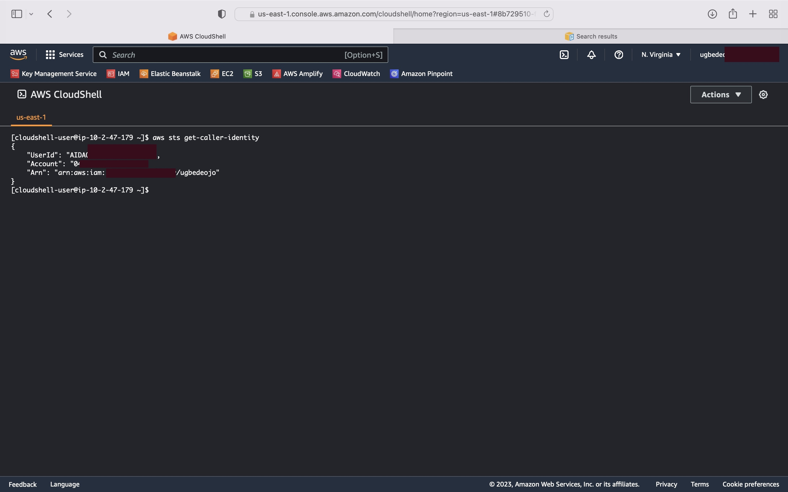

# Week 0 — Billing and Architecture

## Required Homework/Tasks

### Create Admin user

Created AWS Admin user in my console


### Using CloudShell

The following steps outline the process of installing the AWS CLI on macOS using the interactive terminal in CloudShell. To follow this installation, check out the [AWS CLI install documentation page](https://docs.aws.amazon.com/cli/latest/userguide/getting-started-install.html)


After installation of the executable, I ran this command by typing `aws` and received this error:


Resolved the error by displaying my account identity with the command:

```
 aws sts get-caller-identity
```



### Recreate Logical Architectural Design


[Lucid Charts Share Link](https://lucid.app/lucidchart/531d8a6c-aceb-4319-abbe-ff8b659754c6/edit?viewport_loc=-4034%2C-21%2C2607%2C1502%2C0_0&invitationId=inv_54e0dc7c-929f-4083-918d-91a6f2e5d94a)


### AWS Credentials

I was able to generate different AWS Credentials for my account. 

### Billing and Budget

I was able to setup AWS Billing and created a budget on my root account.

### Create a Budget

A budget of $5 was created.


